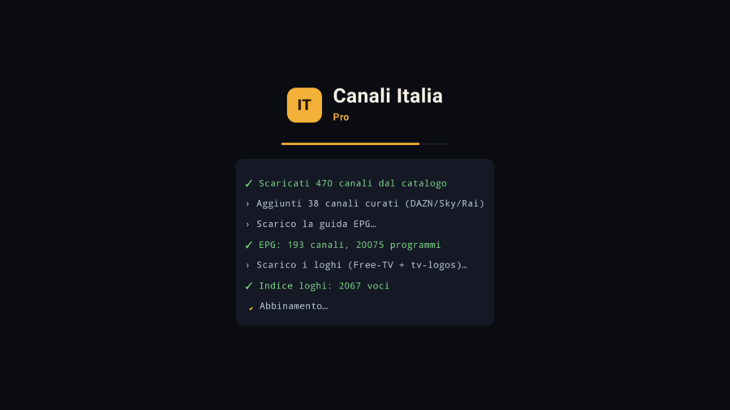
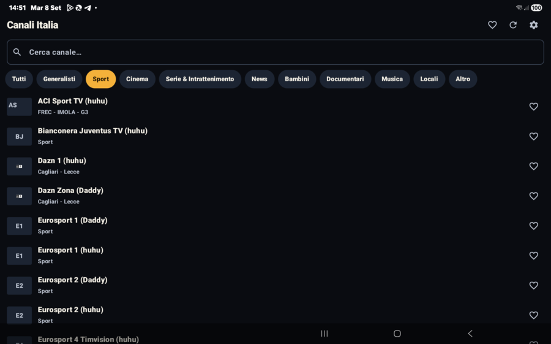
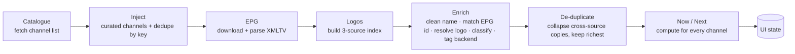

<div align="center">

# Canali Italia Pro

**IPTV player for Italian TV — Android TV, tablet & phone.**
Live channels with EPG, station logos, category browsing and a resilient two-engine player.

-3DDC84?logo=android&logoColor=white)


 

</div>

---

## ⚠️ Personal use only

This project is developed and published **expressly for personal, private use** by its
author. It is a technical exercise in Android media playback and stream resolution.

- It ships **no stream content and no channel lists.** Every URL is fetched at runtime
  from third-party catalogues that the app neither operates nor controls.
- It **does not host, cache, proxy, rebroadcast or redistribute** any stream.
- Provided **as-is, with no warranty** of any kind.
- Whoever builds or runs it is **solely responsible** for ensuring their use complies with
  the terms of service of every source involved and with the law of their country.
  Use it for nothing other than personal viewing.

---

## What it does

### Channel guide
- **Aggregated line-up** — merges a live Italian channel catalogue (~470 channels) with a
  set of hand-curated entries (DAZN / Sky / Rai and similar).
- **Cross-source de-duplication** — the same channel coming from two backends is collapsed
  into the richest copy (the one that has an EPG id and a logo), while curated entries are
  always kept.
- **Backend tag** — every channel name is suffixed with the engine that will play it,
  `… (huhu)` or `… (Daddy)`, so both copies stay recognisable.
- **Category browsing** — rule-based classification into *Generalisti, Sport, Cinema,
  Serie & Intrattenimento, News, Bambini, Documentari, Musica, Locali, Altro*, with filter
  chips.
- **Search** — instant name filter with a cursor-stable input field.
- **Favourites** — per-channel toggle, favourites-only view, persisted locally.

### EPG (now / next)
- Downloads and stream-parses an **XMLTV** guide (~20 000 programmes).
- Matches programmes to channels by `tvg-id`, falling back to normalised-name matching.
- Each row shows the **current programme**; a per-minute ticker keeps the progress fresh.
- Timestamps are handled with their real UTC offset (device shows local time).

### Logos
Three-tier resolver, first hit wins:
1. the EPG `<icon>` for the matched channel,
2. `tvg-logo` from a public Free-TV / IPTV playlist,
3. the *tv-logo/tv-logos* GitHub catalogue (~300 Italian logos).

Fuzzy matching is length-guarded to avoid wrong logos on tagged names; when nothing
matches, a tinted **initials badge** is drawn instead — never an overlap.

### Player — two engines, picked automatically

| Engine | Used for | Highlights |
|---|---|---|
| **ExoPlayer** (`PlayerScreen`) | direct HLS + resolved handles | tuned buffering (start in ~1.5 s, keep a deep 60 s buffer), 20 s read timeout for slow origins, **preferred Italian audio track**, silent auto-retry on token expiry / transient CDN errors, automatic `https→http` fallback for origins with expired certificates, on-screen **stats overlay** (resolution · fps · codec · bitrate · buffer), aspect-ratio cycle, mute, Picture-in-Picture |
| **WebView** (`WebPlayerScreen`) | channels whose CDN only serves the source site's own JS player | loads the real player page in system Chromium with the correct `Referer`, blocks ads / pop-unders / trackers, strips the `X-Requested-With` header, HTML5 fullscreen, PiP, and a clean *“source unavailable”* state instead of a black screen |

### Stream resolution
- **Catalogue handle** → `POST` resolve call → real playlist URL (then `https→http`).
- **"Daddy" / dlive channel** → scrape the source's own `stream/stream-<id>.php` page for
  the **current per-channel player endpoint** (the path rotates and differs per channel, so
  it is never guessed), then hand that page to the WebView engine. Self-updates when the
  upstream domain rotates.
- **Plain URL** → played directly.

### Platform
- **Android TV / leanback** launcher entry, D-pad navigation, auto-PiP on *user-leave*.
- Also runs on phone / tablet in portrait.
- Dark theme, custom palette and typography; a splash screen with a **live sync log**
  (channels downloaded → EPG parsed → logos indexed → matching).

---

## How a refresh works



---

## Architecture

Single-activity Jetpack Compose app, manual DI (`App` → `AppContainer`), Kotlin
coroutines / `Flow`.

| Package | Responsibility |
|---|---|
| `data/IptvRepository` | the refresh pipeline above; exposes `channels`, `nowNext`, `sync`, `log` as `StateFlow` |
| `data/remote/HuhuApi` | channel catalogue + on-demand stream resolve |
| `data/remote/DliveResolver` | scrapes the current per-channel player endpoint (rotation-proof) |
| `data/remote/InjectedChannels` | hand-curated extra channels |
| `data/parser/XmltvParser` | streaming XMLTV reader (`XmlPullParser`) |
| `data/epg/EpgIndex` · `LogoResolver` | now/next lookup · multi-source logo lookup |
| `data/SettingsStore` | favourites + toggles (`SharedPreferences`) |
| `core/Http` · `core/NameTools` | shared HTTP primitive · name cleaning / match keys / classification |
| `ui/channels` · `ui/player` · `ui/settings` · `ui/splash` | screens (`*Screen` + state) |
| `ui/AppViewModel` | combines repo flows into UI state; minute ticker |

---

## Build & install

```sh
./gradlew :app:assembleDebug
adb install -r app/build/outputs/apk/debug/app-debug.apk
```

- Requires an Android SDK — set `sdk.dir` in `local.properties` (not committed).
- Toolchain: AGP 9, Kotlin 2.3, Gradle 9.1, JDK 17 (auto-provisioned via the foojay resolver).
- A ready-made debug APK is attached to each [release](https://github.com/mich-de/italyitvpro/releases).
  Installing over a differently-signed copy needs `adb uninstall com.michde.italyitv` first.

## Tech stack

Kotlin · Jetpack Compose (Material 3) · Media3 1.6.1 (ExoPlayer + HLS) · AndroidX WebKit ·
OkHttp + `HttpURLConnection` · Coil 3 · `XmlPullParser` · Navigation via a small Compose
back-stack.
